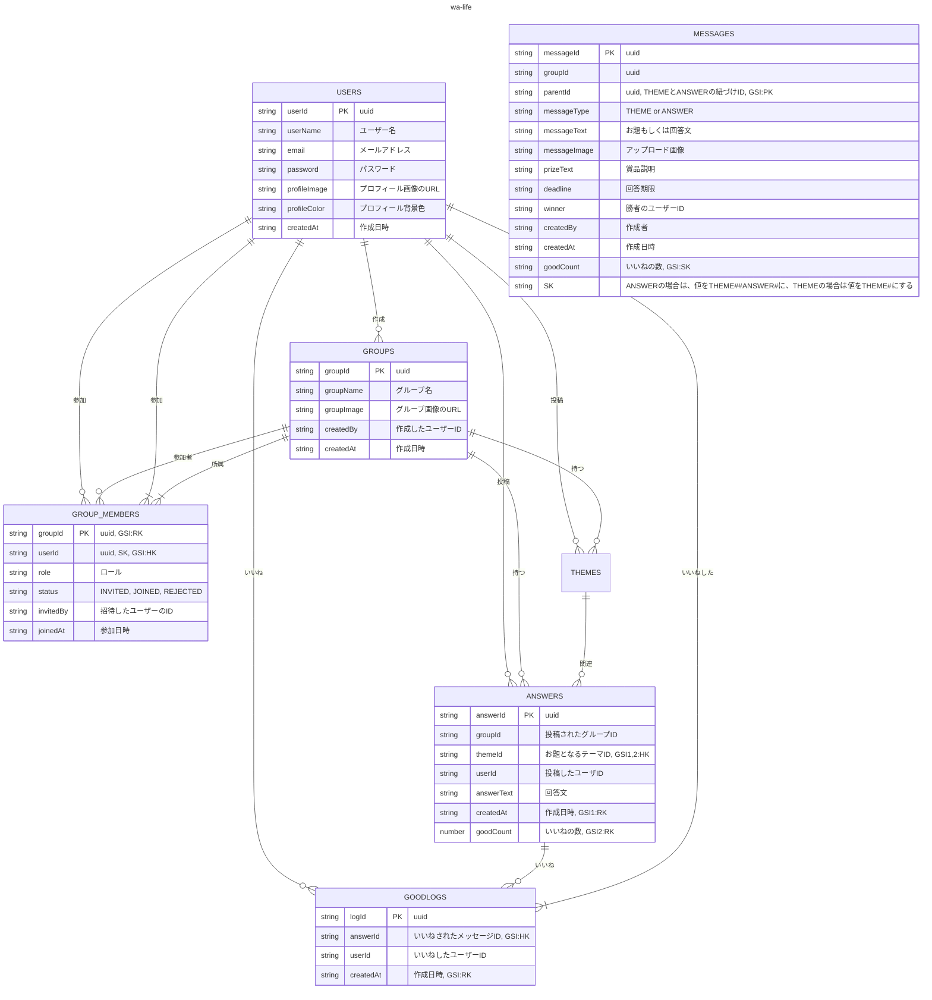

# ER 図

## DynamoDB 設計

```mermaid
---
title: "wa-life"
---
erDiagram
    USERS {
        string userId PK "uuid"
        string userName "ユーザー名"
        string email "メールアドレス"
        string password "パスワード"
        string profileImage "プロフィール画像のURL"
        string profileColor "プロフィール背景色"
        string createdAt "作成日時"
    }

    GROUPS {
        string groupId PK "uuid"
        string groupName "グループ名"
        string groupImage "グループ画像のURL"
        string createdBy "作成したユーザーID"
        string createdAt "作成日時"
    }

    GROUP_MEMBERS {
        string groupId PK "uuid, GSI:RK"
        string userId "uuid, SK, GSI:HK"
        string role "ロール"
        string status "INVITED, JOINED, REJECTED"
        string invitedBy "招待したユーザーのID"
        string joinedAt "参加日時"
    }

    MESSAGES {
        string messageId PK "uuid"
        string groupId "uuid"
        string parentId "uuid, THEMEとANSWERの紐づけID, GSI:PK"
        string messageType "THEME or ANSWER"
        string messageText "お題もしくは回答文"
        string messageImage "アップロード画像"
        string prizeText "賞品説明"
        string deadline "回答期限"
        string winner "勝者のユーザーID"
        string createdBy "作成者"
        string createdAt "作成日時"
        string goodCount "いいねの数, GSI:SK"
        string SK "ANSWERの場合は、値をTHEME#<parentId>#ANSWER#<messageId>に、THEMEの場合は値をTHEME#<messageId>にする"
    }

    ANSWERS {
        string answerId PK "uuid"
        string groupId "投稿されたグループID"
        string themeId "お題となるテーマID, GSI1,2:HK"
        string userId "投稿したユーザID"
        string answerText "回答文"
        string createdAt "作成日時, GSI1:RK"
        number goodCount "いいねの数, GSI2:RK"
    }

    GOODLOGS {
        string logId PK "uuid"
        string answerId "いいねされたメッセージID, GSI:HK"
        string userId "いいねしたユーザーID"
        string createdAt "作成日時, GSI:RK"
    }

    USERS ||--o{ GROUPS : "作成"
    USERS ||--o{ GROUP_MEMBERS : "参加"
    USERS ||--o{ THEMES : "投稿"
    USERS ||--o{ ANSWERS : "投稿"
    USERS ||--o{ GOODLOGS : "いいね"

    GROUPS ||--o{ THEMES : "持つ"
    GROUPS ||--o{ ANSWERS : "持つ"
    GROUPS ||--o{ GROUP_MEMBERS : "参加者"

    GROUP_MEMBERS }|--|| USERS : "参加"
    GROUP_MEMBERS }|--|| GROUPS : "所属"

    THEMES ||--o{ ANSWERS : "関連"

    ANSWERS ||--o{ GOODLOGS : "いいね"

    GOODLOGS }|--|| USERS : "いいねした"

```
